# Mem0g Testing Platform - Design Document

## 📋 목차
1. [프로젝트 개요](#프로젝트-개요)
2. [시스템 아키텍처](#시스템-아키텍처)
3. [기술 스택](#기술-스택)
4. [핵심 컴포넌트](#핵심-컴포넌트)
5. [주요 기능](#주요-기능)
6. [데이터 흐름](#데이터-흐름)
7. [구현 계획](#구현-계획)
8. [테스트 전략](#테스트-전략)

---

## 프로젝트 개요

### 목적
Mem0의 그래프 기반 메모리(Mem0g) 기능을 완전히 활용하는 대화형 테스트 플랫폼 구축

### 핵심 요구사항
- ✅ **그래프 기반 메모리**: Neo4j 또는 Kuzu를 백엔드로 사용
- ✅ **로컬 LLM**: Ollama를 통한 완전한 오프라인 실행
- ✅ **WebUI**: 직관적인 웹 인터페이스
- ✅ **완전한 Mem0g 활용**: 엔티티-관계 추출, 시맨틱 검색, 메모리 진화

### 주요 특징
- 🧠 **지능형 메모리 관리**: 엔티티와 관계를 자동으로 추출하고 저장
- 🔍 **고급 검색**: 벡터 유사도 + BM25 리랭킹 결합
- 📊 **그래프 시각화**: 메모리 구조를 실시간으로 시각화
- 🧪 **종합 테스트 스위트**: Mem0g의 모든 기능을 테스트하는 도구

---

## 시스템 아키텍처

### 전체 아키텍처

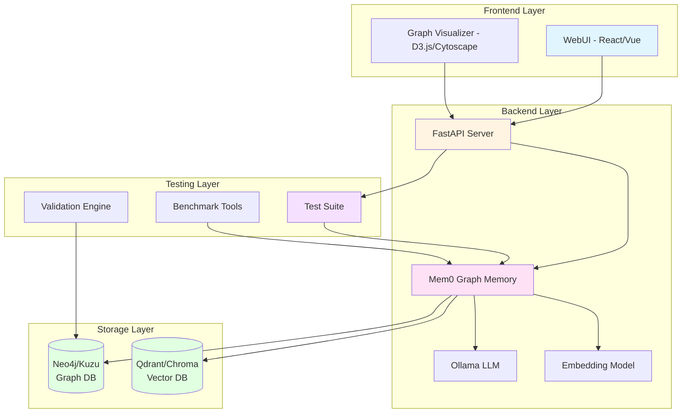

### 컴포넌트 상호작용

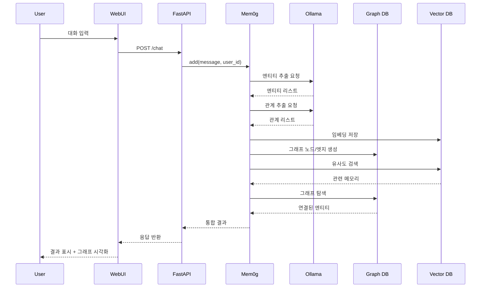

---

## 기술 스택

### Backend
| 카테고리 | 기술 | 용도 |
|---------|------|------|
| **Framework** | FastAPI | REST API 서버 |
| **Memory** | Mem0 (0.1.0+) | 그래프 메모리 관리 |
| **LLM** | Ollama | 로컬 언어모델 서버 |
| **LLM Model** | Qwen2.5 (7B) - 한국어 최적화 | 엔티티/관계 추출, 응답 생성 |
| **Embedding Model** | BGE-M3 (Ollama) - 한국어 우수 | 텍스트 임베딩 생성 |
| **Graph DB** | Neo4j / Kuzu | 엔티티-관계 저장 |
| **Vector DB** | Qdrant / Chroma | 임베딩 벡터 저장 |

### 권장 LLM 모델

#### 🥇 1순위: Llama 3.1 / 3.2
```bash
# 가볍고 빠른 버전 (RAM 8GB+)
ollama pull llama3.2:3b

# 정확도 우선 버전 (RAM 16GB+)
ollama pull llama3.1:8b
```

**선택 이유**:
- ✅ Instruction-following 능력 우수 (구조화된 출력에 중요)
- ✅ Mem0 공식 테스트에서 검증됨
- ✅ 안정적이고 널리 사용됨
- ✅ 한국어 지원 양호

**추천 대상**: 대부분의 사용 케이스, 처음 시작하는 경우

---

#### 🥈 2순위: Qwen2.5
```bash
# 균형잡힌 선택 (RAM 16GB+)
ollama pull qwen2.5:7b

# 고성능 버전 (RAM 32GB+)
ollama pull qwen2.5:14b
```

**선택 이유**:
- ✅ **한국어 성능 최고 수준**
- ✅ 다국어 지원 우수 (한중일영)
- ✅ 최신 모델 (2024)
- ✅ 코드 이해 능력 뛰어남

**추천 대상**: 한국어 대화가 주된 경우, 다국어 지원 필요시

---

#### 🥉 3순위: Gemma 2 / Phi-3
```bash
# Google의 최신 모델 (RAM 16GB+)
ollama pull gemma2:9b

# Microsoft의 효율적인 모델 (RAM 8GB+)
ollama pull phi3:3.8b
```

**선택 이유**:
- ✅ 최신 아키텍처
- ✅ 작은 크기 대비 뛰어난 성능
- ✅ 빠른 추론 속도

**추천 대상**: 하드웨어 제약이 있거나 빠른 응답이 필요한 경우

---

#### 📊 모델 비교표

| 모델 | 크기 | RAM 요구량 | 한국어 | 속도 | 정확도 | 추천 용도 |
|------|------|-----------|--------|------|--------|----------|
| **llama3.2:3b** | 3B | 8GB | ⭐⭐⭐ | ⚡⚡⚡⚡ | ⭐⭐⭐ | 빠른 테스트 |
| **llama3.1:8b** | 8B | 16GB | ⭐⭐⭐⭐ | ⚡⚡⚡ | ⭐⭐⭐⭐ | **기본 권장** |
| **qwen2.5:7b** | 7B | 16GB | ⭐⭐⭐⭐⭐ | ⚡⚡⚡ | ⭐⭐⭐⭐ | **한국어 최적** |
| **qwen2.5:14b** | 14B | 32GB | ⭐⭐⭐⭐⭐ | ⚡⚡ | ⭐⭐⭐⭐⭐ | 고성능 |
| **gemma2:9b** | 9B | 16GB | ⭐⭐⭐ | ⚡⚡⚡ | ⭐⭐⭐⭐ | 최신 기술 |
| **phi3:3.8b** | 3.8B | 8GB | ⭐⭐⭐ | ⚡⚡⚡⚡ | ⭐⭐⭐ | 효율성 |

---

#### 💡 최종 권장 설정

**일반적인 경우**:
```python
config = {
    "llm": {
        "provider": "ollama",
        "config": {
            "model": "llama3.1:8b",  # 또는 "qwen2.5:7b"
            "base_url": "http://localhost:11434",
            "temperature": 0.1,
            "max_tokens": 2000
        }
    },
    "embedder": {
        "provider": "ollama",
        "config": {
            "model": "nomic-embed-text"
        }
    }
}
```

**🇰🇷 한국어 완전 최적화 (프로젝트 기본 설정)**:
```python
config = {
    "llm": {
        "provider": "ollama",
        "config": {
            "model": "qwen2.5:7b",  # 한국어 최고 성능
            "base_url": "http://localhost:11434",
            "temperature": 0.1,
            "max_tokens": 2000
        }
    },
    "embedder": {
        "provider": "ollama",
        "config": {
            "model": "bge-m3"  # 한국어 임베딩 우수
        }
    },
    "vector_store": {
        "provider": "qdrant",
        "config": {
            "host": "localhost",
            "port": 6333,
            "collection_name": "mem0g_korean"
        }
    },
    "graph_store": {
        "provider": "neo4j",
        "config": {
            "url": "neo4j://localhost:7687",
            "username": "neo4j",
            "password": "password",
            "database": "neo4j"
        }
    }
}
```

**필요한 모델 다운로드**:
```bash
# 메인 LLM (한국어 최적화)
ollama pull qwen2.5:7b

# 임베딩 모델 (한국어 지원 우수)
ollama pull bge-m3
```

---

### 권장 임베딩 모델 (Embedding Models)

Mem0g는 벡터 유사도 검색을 위해 임베딩 모델이 필요합니다. 한국어 지원이 우수한 모델들을 소개합니다.

#### 🥇 1순위: BGE-M3 (추천!) ⭐
```bash
ollama pull bge-m3
```

```python
config = {
    "embedder": {
        "provider": "ollama",
        "config": {
            "model": "bge-m3"
        }
    }
}
```

**선택 이유**:
- ✅ **한국어 성능 매우 우수**
- ✅ Ollama 네이티브 지원 (완전 로컬 실행)
- ✅ 100개 이상 언어 지원
- ✅ 1024 차원 벡터
- ✅ MTEB 벤치마크 상위권
- ✅ 멀티링구얼 최적화

**추천 대상**: **프로젝트 기본 설정으로 강력 추천**

---

#### 🥈 2순위: Nomic Embed Text
```bash
ollama pull nomic-embed-text
```

```python
config = {
    "embedder": {
        "provider": "ollama",
        "config": {
            "model": "nomic-embed-text"
        }
    }
}
```

**선택 이유**:
- ✅ 한국어 지원 양호
- ✅ Ollama 네이티브 지원
- ✅ 빠른 추론 속도
- ✅ 768 차원 벡터
- ✅ 경량 모델

**추천 대상**: 빠른 응답이 중요한 경우

---

#### 🥉 3순위: MXBAI Embed Large
```bash
ollama pull mxbai-embed-large
```

```python
config = {
    "embedder": {
        "provider": "ollama",
        "config": {
            "model": "mxbai-embed-large"
        }
    }
}
```

**선택 이유**:
- ✅ 다국어 지원
- ✅ Ollama 네이티브 지원
- ✅ 1GB 크기
- ✅ 1024 차원 벡터

**추천 대상**: 균형잡힌 선택

---

#### 📊 임베딩 모델 비교표

| 모델 | 차원 | 크기 | 한국어 | 속도 | 정확도 | Ollama 지원 |
|------|------|------|--------|------|--------|-------------|
| **bge-m3** | 1024 | ~2.2GB | ⭐⭐⭐⭐⭐ | ⚡⚡⚡ | ⭐⭐⭐⭐⭐ | ✅ |
| **nomic-embed-text** | 768 | ~274MB | ⭐⭐⭐⭐ | ⚡⚡⚡⚡ | ⭐⭐⭐⭐ | ✅ |
| **mxbai-embed-large** | 1024 | ~1GB | ⭐⭐⭐ | ⚡⚡⚡ | ⭐⭐⭐⭐ | ✅ |
| **jhgan/ko-sbert** | 768 | ~500MB | ⭐⭐⭐⭐⭐ | ⚡⚡⚡⭐ | ⭐⭐⭐⭐⭐ | ❌ (HuggingFace) |

---

#### 💡 한국어 특화 대안 (HuggingFace)

Ollama를 사용할 수 없는 경우, HuggingFace 모델을 직접 사용할 수 있습니다:

```python
config = {
    "embedder": {
        "provider": "huggingface",
        "config": {
            "model": "jhgan/ko-sbert-multitask"  # 한국어 최고
        }
    }
}
```

**한국어 특화 모델**:
- `jhgan/ko-sbert-multitask` - 한국어 SBERT, 가장 높은 한국어 성능
- `BM-K/KoSimCSE-roberta` - 한국어 SimCSE
- `dragonkue/BGE-m3-korean` - BGE-M3 한국어 파인튜닝

**단점**: HuggingFace 의존성 추가, Ollama만큼 통합이 간편하지 않음

---

#### 🎯 프로젝트 최종 권장 조합

**완전 로컬 + 한국어 최적화**:
```bash
# 다운로드
ollama pull qwen2.5:7b    # 메인 LLM
ollama pull bge-m3        # 임베딩 모델
```

이 조합은:
- ✅ 완전한 로컬 실행 (인터넷 불필요)
- ✅ 한국어 성능 최고 수준
- ✅ Mem0와 완벽한 호환성
- ✅ 통합 간편함

---

### Frontend
| 카테고리 | 기술 | 용도 |
|---------|------|------|
| **Framework** | React + TypeScript | UI 컴포넌트 |
| **Styling** | TailwindCSS | 스타일링 |
| **Graph Viz** | Cytoscape.js | 그래프 시각화 |
| **State** | Zustand | 상태 관리 |
| **HTTP Client** | Axios | API 통신 |

### DevOps
- **Container**: Docker + Docker Compose
- **Testing**: pytest, Jest
- **Linting**: Black, ESLint, Prettier

---

## 핵심 컴포넌트

### 1. Mem0 Graph Memory 래퍼

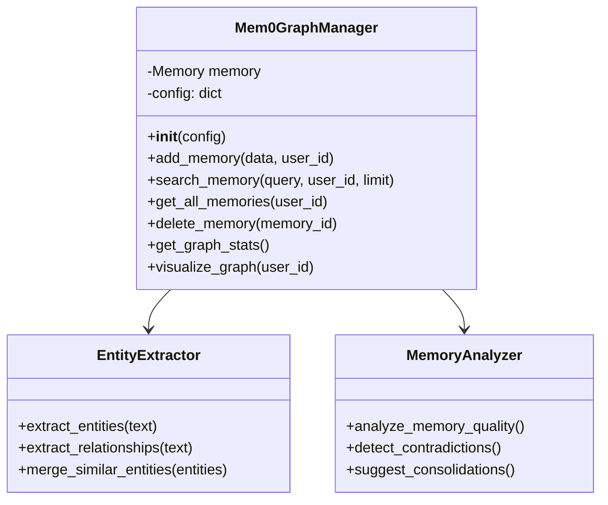

### 2. API 엔드포인트 구조

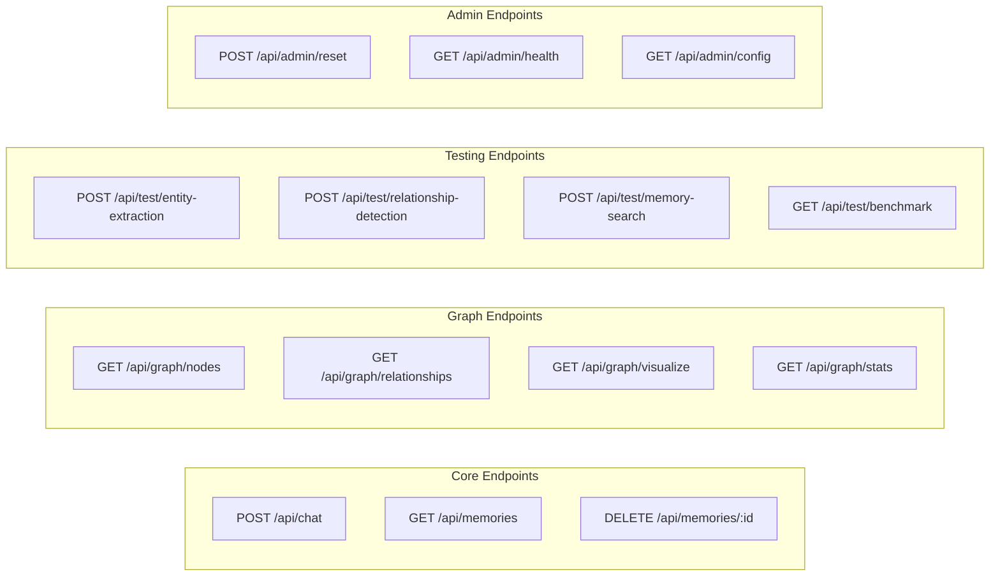

### 3. Frontend 컴포넌트 구조

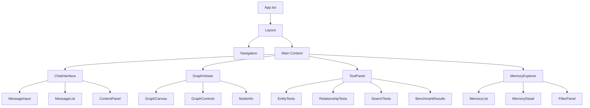

---

## 주요 기능

### 1. 대화 메모리 관리

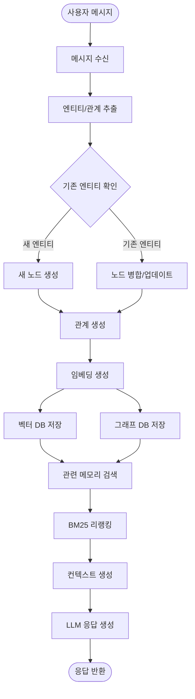

### 2. 엔티티 추출 프로세스

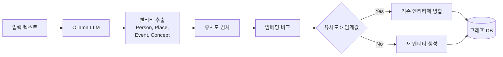

### 3. 메모리 검색 플로우

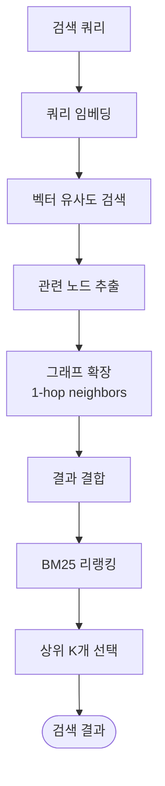

### 4. 그래프 시각화

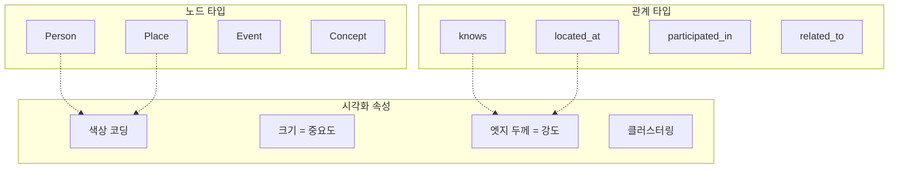

---

## 데이터 흐름

### 전체 데이터 플로우

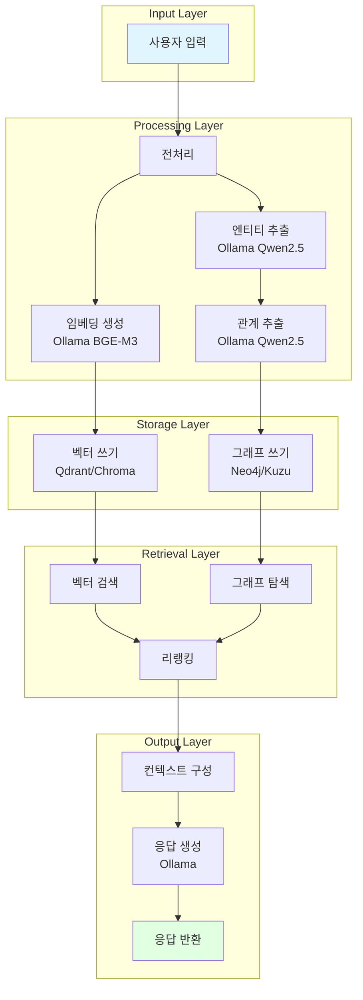

### 메모리 진화 프로세스

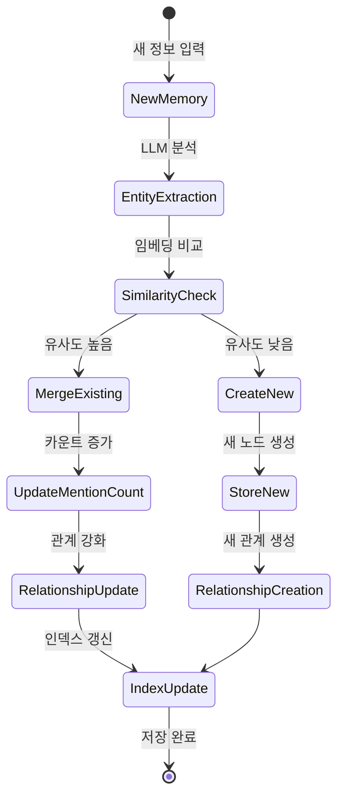

---

## 구현 계획

### Phase 1: 인프라 구축 (Week 1)

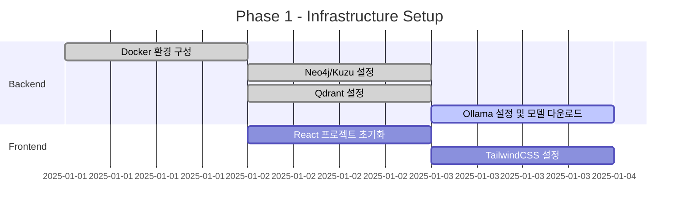

**주요 작업**:
- [x] Docker Compose 설정 (Neo4j, Qdrant, Ollama)
- [x] Mem0 라이브러리 설치 및 설정
- [ ] 기본 FastAPI 서버 구축
- [ ] React 프로젝트 초기화

### Phase 2: 핵심 기능 구현 (Week 2-3)

**Backend**:
1. Mem0 Graph Memory 통합
   - Neo4j/Kuzu 연결 설정
   - 엔티티/관계 추출 파이프라인
   - 메모리 검색 엔진

2. Ollama LLM 통합
   - 모델 선택 및 최적화
   - 프롬프트 엔지니어링
   - 스트리밍 응답 처리

3. API 엔드포인트 구현
   - CRUD 작업
   - 그래프 쿼리
   - 테스트 엔드포인트

**Frontend**:
1. UI 컴포넌트 개발
   - 채팅 인터페이스
   - 메모리 탐색기
   - 설정 패널

2. 그래프 시각화
   - Cytoscape.js 통합
   - 실시간 업데이트
   - 인터랙티브 컨트롤

### Phase 3: 테스트 기능 구현 (Week 4)

**테스트 스위트**:
1. 엔티티 추출 테스트
2. 관계 감지 테스트
3. 메모리 검색 정확도 테스트
4. 그래프 무결성 검증
5. 성능 벤치마크

**UI 통합**:
1. 테스트 패널 구현
2. 결과 시각화
3. 비교 분석 도구

### Phase 4: 최적화 및 문서화 (Week 5)

- [ ] 성능 최적화
- [ ] 에러 처리 강화
- [ ] 사용자 가이드 작성
- [ ] API 문서 자동 생성

---

## 테스트 전략

### 1. 엔티티 추출 테스트

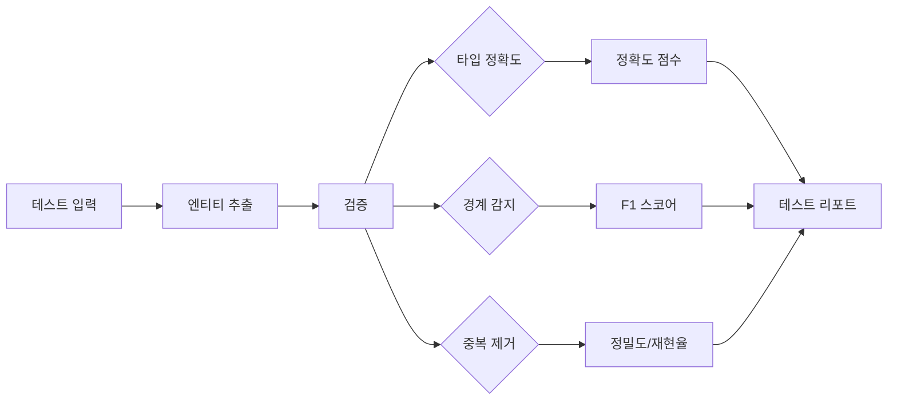

**테스트 케이스**:
- 명명된 엔티티 (인명, 지명)
- 복잡한 개념
- 중의적 표현
- 다국어 지원

### 2. 관계 추출 테스트

**평가 지표**:
- 관계 타입 정확도
- 방향성 정확도
- 속성 추출 정확도

**벤치마크 데이터셋**:
- 수작업 레이블링 대화 샘플
- 실제 사용 시나리오 재현

### 3. 메모리 검색 테스트

```python
# 예시 테스트 시나리오
test_scenarios = [
    {
        "name": "직접 정보 회수",
        "setup": ["Alice는 서울에 산다"],
        "query": "Alice는 어디에 사나?",
        "expected": "서울"
    },
    {
        "name": "추론 기반 검색",
        "setup": [
            "Alice는 Bob의 친구다",
            "Bob은 개발자다"
        ],
        "query": "Alice의 친구가 하는 일은?",
        "expected": "개발자"
    },
    {
        "name": "시간적 추론",
        "setup": [
            "2024년에 Alice는 학생이었다",
            "2025년에 Alice는 취업했다"
        ],
        "query": "Alice의 현재 상태는?",
        "expected": "취업함"
    }
]
```

### 4. 성능 벤치마크

| 지표 | 목표 | 측정 방법 |
|-----|------|----------|
| **메모리 추가 지연시간** | < 2초 | 엔티티 추출 ~ 저장 완료 |
| **검색 응답 시간** | < 500ms | 쿼리 ~ 결과 반환 |
| **그래프 탐색 성능** | < 100ms | 1-hop 이웃 검색 |
| **동시 사용자** | 10+ | 부하 테스트 |

---

## 설정 예시

### Mem0 Graph Memory 설정 (한국어 최적화)

```python
# 프로덕션 설정 - 한국어 완전 최적화
config = {
    "llm": {
        "provider": "ollama",
        "config": {
            "model": "qwen2.5:7b",  # 한국어 최고 성능
            "base_url": "http://localhost:11434",
            "temperature": 0.1,      # 엔티티 추출은 낮은 temperature 권장
            "max_tokens": 2000,
            "num_ctx": 8192         # 컨텍스트 윈도우
        }
    },
    "embedder": {
        "provider": "ollama",
        "config": {
            "model": "bge-m3"        # 한국어 임베딩 우수
        }
    },
    "vector_store": {
        "provider": "qdrant",
        "config": {
            "host": "localhost",
            "port": 6333,
            "collection_name": "mem0g_korean",
            "embedding_dim": 1024    # bge-m3의 차원
        }
    },
    "graph_store": {
        "provider": "neo4j",         # 또는 "kuzu"
        "config": {
            "url": "neo4j://localhost:7687",
            "username": "neo4j",
            "password": "password",
            "database": "neo4j"
        }
    },
    "version": "v1.1"
}
```

### 대안 설정 (Kuzu 사용)

```python
# Kuzu는 설치 없이 파일 기반으로 작동
config = {
    "llm": {
        "provider": "ollama",
        "config": {
            "model": "qwen2.5:7b",
            "base_url": "http://localhost:11434",
            "temperature": 0.1,
            "max_tokens": 2000
        }
    },
    "embedder": {
        "provider": "ollama",
        "config": {
            "model": "bge-m3"
        }
    },
    "vector_store": {
        "provider": "qdrant",
        "config": {
            "host": "localhost",
            "port": 6333,
            "collection_name": "mem0g_korean"
        }
    },
    "graph_store": {
        "provider": "kuzu",
        "config": {
            "db_path": "./data/mem0g.kuzu"  # 로컬 파일 경로
        }
    },
    "version": "v1.1"
}
```

### Docker Compose 구성

```yaml
version: '3.8'

services:
  neo4j:
    image: neo4j:5.15
    ports:
      - "7474:7474"
      - "7687:7687"
    environment:
      NEO4J_AUTH: neo4j/password
    volumes:
      - neo4j_data:/data

  qdrant:
    image: qdrant/qdrant:latest
    ports:
      - "6333:6333"
    volumes:
      - qdrant_data:/qdrant/storage

  ollama:
    image: ollama/ollama:latest
    ports:
      - "11434:11434"
    volumes:
      - ollama_data:/root/.ollama

  backend:
    build: ./backend
    ports:
      - "8000:8000"
    depends_on:
      - neo4j
      - qdrant
      - ollama
    environment:
      - NEO4J_URL=neo4j://neo4j:7687
      - QDRANT_HOST=qdrant
      - OLLAMA_BASE_URL=http://ollama:11434

  frontend:
    build: ./frontend
    ports:
      - "3000:3000"
    depends_on:
      - backend

volumes:
  neo4j_data:
  qdrant_data:
  ollama_data:
```

---

## 프로젝트 디렉토리 구조

```
mem0g-test/
├── backend/
│   ├── app/
│   │   ├── __init__.py
│   │   ├── main.py                 # FastAPI 앱
│   │   ├── config.py               # 설정 관리
│   │   ├── api/
│   │   │   ├── __init__.py
│   │   │   ├── chat.py            # 채팅 엔드포인트
│   │   │   ├── memory.py          # 메모리 관리
│   │   │   ├── graph.py           # 그래프 쿼리
│   │   │   └── test.py            # 테스트 엔드포인트
│   │   ├── core/
│   │   │   ├── __init__.py
│   │   │   ├── mem0_manager.py    # Mem0 래퍼
│   │   │   ├── ollama_client.py   # Ollama 클라이언트
│   │   │   └── graph_utils.py     # 그래프 유틸리티
│   │   ├── models/
│   │   │   ├── __init__.py
│   │   │   ├── schemas.py         # Pydantic 스키마
│   │   │   └── entities.py        # 엔티티 모델
│   │   └── tests/
│   │       ├── __init__.py
│   │       ├── test_entity.py     # 엔티티 테스트
│   │       ├── test_relation.py   # 관계 테스트
│   │       └── test_memory.py     # 메모리 테스트
│   ├── requirements.txt
│   ├── Dockerfile
│   └── pytest.ini
├── frontend/
│   ├── src/
│   │   ├── App.tsx
│   │   ├── main.tsx
│   │   ├── components/
│   │   │   ├── Chat/
│   │   │   │   ├── ChatInterface.tsx
│   │   │   │   ├── MessageInput.tsx
│   │   │   │   └── MessageList.tsx
│   │   │   ├── Graph/
│   │   │   │   ├── GraphViewer.tsx
│   │   │   │   ├── GraphCanvas.tsx
│   │   │   │   └── GraphControls.tsx
│   │   │   ├── Memory/
│   │   │   │   ├── MemoryExplorer.tsx
│   │   │   │   └── MemoryDetail.tsx
│   │   │   └── Test/
│   │   │       ├── TestPanel.tsx
│   │   │       └── BenchmarkResults.tsx
│   │   ├── services/
│   │   │   └── api.ts             # API 클라이언트
│   │   ├── stores/
│   │   │   └── appStore.ts        # Zustand 스토어
│   │   └── types/
│   │       └── index.ts           # TypeScript 타입
│   ├── package.json
│   ├── tsconfig.json
│   ├── vite.config.ts
│   └── Dockerfile
├── docker-compose.yml
├── DESIGN.md                       # 이 파일
├── README.md
└── .env.example
```

---

## 다음 단계

이 설계 문서를 기반으로 다음 작업을 진행합니다:

1. ✅ **설계 검토 및 승인**
2. ⏭️ **인프라 구축**: Docker 환경 설정
3. ⏭️ **Backend 구현**: FastAPI + Mem0 + Ollama
4. ⏭️ **Frontend 구현**: React + 그래프 시각화
5. ⏭️ **테스트 구현**: 종합 테스트 스위트
6. ⏭️ **문서화**: 사용자 가이드 및 API 문서

---

## 참고 자료

- [Mem0 공식 문서](https://docs.mem0.ai/)
- [Mem0 Graph Memory 가이드](https://docs.mem0.ai/open-source/features/graph-memory)
- [Neo4j Documentation](https://neo4j.com/docs/)
- [Kuzu Documentation](https://docs.kuzudb.com/)
- [Ollama Documentation](https://ollama.ai/docs)
- [FastAPI Documentation](https://fastapi.tiangolo.com/)
- [Cytoscape.js](https://js.cytoscape.org/)
